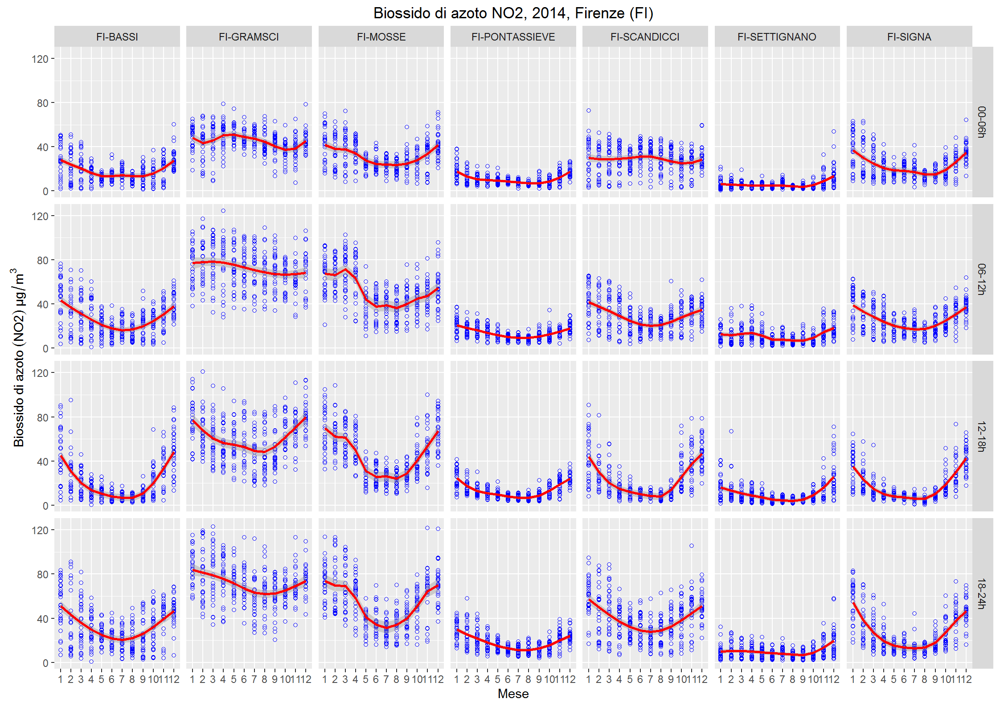
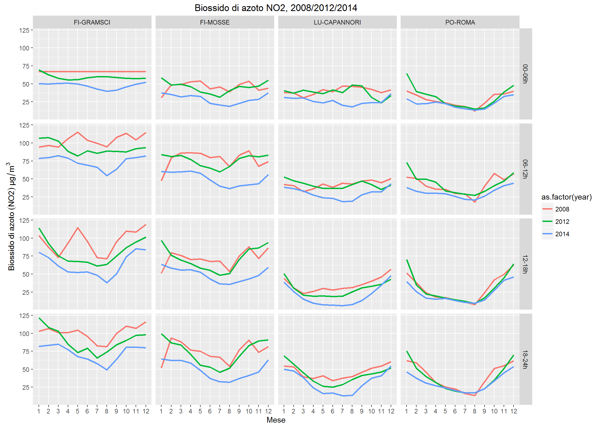

# Aria Toscana
Patrick Hausmann  
08/02/2016  

<!-- README.md is generated from README.Rmd. Please edit that file -->


```r

library('ggplot2')
library('tidyr')
library('dplyr')
#> 
#> Attaching package: 'dplyr'
#> The following objects are masked from 'package:stats':
#> 
#>     filter, lag
#> The following objects are masked from 'package:base':
#> 
#>     intersect, setdiff, setequal, union
library('AriaToscana')

options(stringsAsFactors = FALSE,
        knitr.table.format = 'markdown')
```


```r

addmargins(table(at_inq$parameter, at_inq$year)) %>% 
  knitr::kable(format.args = list(big.mark = '.', decimal.mark = ','))
```


|          |      2008|      2009|      2010|      2011|      2012|      2013|      2014|        Sum|
|:---------|---------:|---------:|---------:|---------:|---------:|---------:|---------:|----------:|
|BENZENE   |    61.488|    43.800|    43.800|    35.040|    26.352|         0|    52.560|    263.040|
|CH4       |    43.920|    43.800|    52.560|    26.280|    17.568|         0|         0|    184.128|
|CO        |   342.576|   341.640|   341.542|   245.280|   105.408|    61.320|    70.080|  1.507.846|
|EBENZENE  |    52.704|    43.800|    43.800|    35.040|    26.352|         0|    52.560|    254.256|
|H2S       |    43.920|    43.800|    43.800|    26.280|    17.568|    17.520|    17.520|    210.408|
|HCL       |     8.784|     8.760|     8.760|         0|         0|         0|         0|     26.304|
|M-XYLENE  |    43.920|    43.800|    43.800|    35.040|    26.352|         0|         0|    192.912|
|MP-XILENE |     8.784|         0|         0|         0|         0|         0|         0|      8.784|
|MP-XYLENE |         0|         0|         0|         0|         0|         0|    26.280|     26.280|
|N-EPTANO  |    17.568|    17.520|    17.520|     8.760|     8.784|         0|         0|     70.152|
|N-ESANO   |    17.568|    17.520|    17.520|     8.760|     8.784|         0|         0|     70.152|
|N-OTTANO  |    17.568|    17.520|    17.520|     8.760|     8.784|         0|         0|     70.152|
|NH3       |    17.568|    17.520|    17.520|     8.760|         0|         0|         0|     61.368|
|NMHC      |    43.920|    43.800|    52.560|    26.280|    17.568|         0|         0|    184.128|
|NO        |   518.256|   534.360|   534.360|   402.960|   377.712|   315.360|   332.880|  3.015.888|
|NO2       |   518.256|   534.360|   534.360|   402.960|   377.712|   315.360|   332.880|  3.015.888|
|NOX       |   518.256|   534.360|   534.360|   402.960|   377.712|   315.360|   332.880|  3.015.888|
|O-XYLENE  |    43.920|    43.800|    43.800|    35.040|    26.352|         0|    52.560|    245.472|
|O3        |   281.088|   289.080|   262.796|   227.760|   166.896|   113.880|   105.120|  1.446.620|
|P-XYLENE  |    52.704|    43.800|    43.800|    35.040|    26.352|         0|    26.280|    227.976|
|SO2       |   158.112|   166.440|   148.920|   105.120|    52.704|    26.280|    35.040|    692.616|
|TN        |    17.568|    17.520|    17.520|     8.760|         0|         0|         0|     61.368|
|TNX       |    17.568|    17.520|    17.520|     8.760|         0|         0|         0|     61.368|
|TOLUENE   |    61.488|    43.800|    43.800|    35.040|    26.352|         0|    52.560|    263.040|
|Sum       | 2.907.504| 2.908.320| 2.881.938| 2.128.680| 1.695.312| 1.165.080| 1.489.200| 15.176.034|


```r

# If 4 or more measures are 'NA', then 'NA' for the whole time frame (br)
ff <- function(L) ifelse(sum(is.na(L)) >= 4, NA, mean(L, na.rm = TRUE))

x1 <- tbl_df(at_inq) %>%
       filter(year %in% c(2008, 2012, 2014) & parameter %in% c("O3", "NO2", "CO")) %>%
       mutate(br = factor(cut(hour, breaks = 4), 
                          labels = c("00-06h", "06-12h", 
                                     "12-18h", "18-24h")),
              provincia = substr(stazione, 1, 2)) %>%
       group_by(provincia, stazione, year, month, day, parameter, br) %>%
       summarise(val_na   = sum(is.na(value)),
                 val_mean = ff(value))
```


```r

p1 <- ggplot(subset(x1, subset = year == 2014 & parameter == "NO2" & provincia == "FI"), 
             aes(as.factor(month), val_mean, group = year, color = year))
p1 <- p1 + geom_point(shape = 1, col ="blue") 
p1 <- p1 + facet_grid(br ~ stazione) 
p1 <- p1 + stat_smooth(aes(group = 1), col = "red")
p1 <- p1 + labs(title = "Biossido di azoto NO2, 2014, Firenze (FI)")
p1 <- p1 + labs(x = "Mese", y = expression(paste(Biossido~di~azoto~(NO2)~µg/m^3)))
p1
#> Warning: Removed 407 rows containing non-finite values (stat_smooth).
#> Warning: Removed 407 rows containing missing values (geom_point).
```




```r

p2 <- ggplot(subset(x1, subset = 
                         stazione %in% c("LU-CAPANNORI", "FI-MOSSE", 
                                         "FI-GRAMSCI", "PO-ROMA") & 
                         parameter == "NO2"), aes(as.factor(month), val_mean))
p2 <- p2 + facet_grid(br ~ stazione)
p2 <- p2 + stat_smooth(aes(group = as.factor(year), color = as.factor(year)), se = FALSE)
p2 <- p2 + labs(title = "Biossido di azoto NO2, 2008/2012/2014")
p2 <- p2 + labs(x = "Mese", 
                y = expression(paste(Biossido~di~azoto~(NO2)~µg/m^3)))
p2
#> Warning: Removed 625 rows containing non-finite values (stat_smooth).
```



## PM10

This is table 4.1.2. on page 18 from the [last report 2015](http://www.arpat.toscana.it/documentazione/catalogo-pubblicazioni-arpat/relazione-annuale-sullo-stato-della-qualita-dellaria-nella-regione-toscana-anno-2014/attachment_download/pubblicazione)


```r

m <- tbl_df(at_pm) %>%
       filter(parameter == "PM10" & valid == 1) %>%
       group_by(stazione, year) %>%
       mutate(days_gt50 = cumsum(value > 50)) %>%
       select(stazione, year, days_gt50) %>%
       top_n(1, days_gt50) %>%
       distinct(stazione, year) %>%
       ungroup()

mt <- reshape(data.frame(m), timevar = "year", idvar = "stazione", direction = "wide")
rownames(mt) <- NULL
names(mt) <- sub("days_gt50.", "", names(mt))
mt %>% knitr::kable()
```


|stazione                      | 2008| 2009| 2010| 2011| 2012| 2013| 2014|
|:-----------------------------|----:|----:|----:|----:|----:|----:|----:|
|AR-CASA-STABBI                |    1|    0|    0|    0|    1|    0|    4|
|AR-PIAZZA-REPUBBLICA          |   17|   15|   20|   NA|   NA|   NA|   NA|
|AR-VIA-FIORENTINA             |   44|   36|   26|   NA|   NA|   NA|   NA|
|AR-REPUBBLICA                 |   NA|   NA|   NA|   34|   29|   26|   31|
|AR-ACROPOLI                   |   NA|   NA|   NA|   NA|   NA|   12|    9|
|FI-BASSI                      |   33|   23|   13|   19|   11|   17|    4|
|FI-BOBOLI                     |   19|   13|   10|   17|    7|   18|    3|
|FI-CALENZANO-BOCCACCIO        |   56|   20|   NA|   NA|   NA|   NA|   NA|
|FI-CAMPI-BISENZIO             |   42|   49|   45|   NA|   NA|   NA|   NA|
|FI-EMPOLI-RIDOLFI             |   16|   23|   48|   NA|   NA|   NA|   NA|
|FI-GRAMSCI                    |   98|   88|   65|   55|   46|   38|   19|
|FI-GREVE-PASSO-PECORAI        |   12|    1|   10|   NA|   NA|   NA|   NA|
|FI-MONTELUPO-VIA-ASIA         |   32|    4|    5|    0|   NA|   NA|   NA|
|FI-MOSSE                      |   88|   82|   66|   59|   69|   46|   11|
|FI-SCANDICCI-BUOZZI           |   49|   48|   38|   NA|   NA|   NA|   NA|
|FI-SIGNA                      |  120|   85|   64|   NA|   NA|   NA|   26|
|FI-CALENZANO-GIOVANNI         |   NA|   64|   52|   NA|   NA|   NA|   NA|
|FI-INCISA                     |   NA|    5|   18|   48|   45|   NA|   NA|
|FI-PONTASSIEVE-CURIEL         |   NA|    5|    2|   NA|   NA|   NA|   NA|
|FI-SESTO                      |   NA|   39|   26|   NA|   NA|   NA|   NA|
|FI-GREVE                      |   NA|   NA|   NA|   17|    3|    0|   NA|
|FI-PONTASSIEVE                |   NA|   NA|   NA|    1|    0|    2|    1|
|FI-SCANDICCI                  |   NA|   NA|   NA|   37|   23|   22|    5|
|FI-SIGNA-ROMA                 |   NA|   NA|   NA|   36|   46|   30|   NA|
|GR-VIA-URSS                   |    3|    4|    0|   NA|   NA|   NA|   NA|
|GR-VIALE-SONNINO              |   29|   17|   29|   NA|   NA|   NA|   NA|
|GR-SONNINO                    |   NA|   NA|   NA|   NA|    5|   NA|   NA|
|GR-URSS                       |   NA|   NA|   NA|   NA|    0|    0|    3|
|LI-COTONE-RETE-LI             |   29|   21|   27|   NA|   NA|   NA|   NA|
|LI-VIA-GOBETTI                |   10|    1|    0|   NA|   NA|   NA|   NA|
|LI-VIA-VENETO                 |   13|   10|    3|   NA|   NA|   NA|   NA|
|LI-VIALE-CARDUCCI             |   40|   20|   11|   NA|   NA|   NA|   NA|
|LI-VILLA-MAUROGORDATO         |    0|    0|    0|   NA|   NA|   NA|   NA|
|LI-POGGIO-SAN-ROCCO-ROSIGNANO |   NA|    0|    0|   NA|   NA|   NA|   NA|
|LI-CARDUCCI                   |   NA|   NA|   NA|    7|    4|    1|    0|
|LI-COTONE                     |   NA|   NA|   NA|   14|    6|    8|    8|
|LI-GOBETTI                    |   NA|   NA|   NA|    2|    0|    3|    0|
|LI-MAUROGORDATO               |   NA|   NA|   NA|    0|    0|   NA|   NA|
|LI-POGGIO-SAN-ROCCO           |   NA|   NA|   NA|    0|    0|    0|   NA|
|LI-VENETO                     |   NA|   NA|   NA|   10|    6|   NA|   NA|
|LI-GIARDINI-PUBBLICI          |   NA|   NA|   NA|   NA|   NA|   44|    3|
|LI-CAPPIELLO                  |   NA|   NA|   NA|   NA|   NA|   NA|    0|
|LI-LAPIRA                     |   NA|   NA|   NA|   NA|   NA|   NA|    0|
|LI-PIOMBINO-PARCO-VIII-MARZO  |   NA|   NA|   NA|   NA|   NA|   NA|    2|
|LU-2VIAREGGIO                 |   59|   27|    9|   NA|   NA|   NA|   NA|
|LU-CAPANNORI                  |   40|   35|   38|   57|   36|   30|   59|
|LU-MICHELETTO                 |   41|   50|   48|   65|   54|   41|   34|
|LU-PORCARI                    |   42|   41|   41|   54|   37|   27|   23|
|LU-TANGENZIALE                |  121|   92|   98|   54|   NA|   NA|   NA|
|LU-VIAREGGIO                  |   NA|   NA|   NA|   37|   15|   21|   11|
|MS-PARCHEGGIO-COLOMBAROTTO    |   18|    5|    2|   NA|   NA|   NA|   NA|
|MS-VIA-CARRIONA               |   73|   62|   57|   NA|   NA|   NA|   NA|
|MS-VIA-FRASSINA               |  211|  166|  161|   51|   NA|   NA|   NA|
|MS-VIA-GALVANI                |   36|   25|   20|   NA|   NA|   NA|   NA|
|MS-CAPUCCINI                  |   NA|    0|    4|    1|   NA|   NA|   NA|
|MS-CARRIONA                   |   NA|   NA|   NA|   30|   NA|   NA|   NA|
|MS-COLOMBAROTTO               |   NA|   NA|   NA|    2|    3|    9|    2|
|MS-GALVANI                    |   NA|   NA|   NA|    9|    8|    7|    9|
|PI-BORGHETTO                  |   36|   31|   31|   44|   35|   31|   18|
|PI-CASCINA                    |   93|   82|   50|   NA|   NA|   NA|   NA|
|PI-LARI                       |   21|   14|   43|   NA|   NA|   NA|   NA|
|PI-MONTECERBOLI-BIS           |    1|    0|    0|   NA|   NA|   NA|   NA|
|PI-NAVACCHIO                  |   72|   49|   31|   NA|   NA|   NA|   NA|
|PI-ORATOIO                    |   40|   45|   29|   NA|   NA|   NA|   NA|
|PI-PONTEDERA                  |   34|   16|   25|   27|    9|   19|    4|
|PI-SAN-ROMANO                 |   60|   38|   28|   18|   NA|   NA|   NA|
|PI-SANTA-CROCE-COOP           |   35|   32|   33|   47|   33|   27|   22|
|PI-SANTA-CROCE-SERAO          |   20|    6|   10|   NA|   NA|   NA|   NA|
|PI-PASSI                      |   NA|   NA|   13|   28|   17|   22|   10|
|PI-MONTECERBOLI               |   NA|   NA|   NA|    0|    1|    0|    0|
|PO-FERRUCCI                   |   41|   51|   45|   50|   44|   37|   28|
|PO-FONTANELLE                 |   39|   53|   NA|   NA|   NA|   NA|   NA|
|PO-ROMA                       |   29|   27|   30|   43|   43|   35|   30|
|PO-STROZZI                    |   28|   28|   36|   NA|   NA|   NA|   NA|
|PO-XX-SETTEMBRE               |   35|   31|   34|   NA|   NA|   NA|   NA|
|PO-POGGIO-A-CAIANO            |   NA|   NA|   NA|   18|   NA|   NA|   NA|
|PT-MONT-VIA-MERLINI           |   59|   46|   30|   22|   NA|   NA|   NA|
|PT-MONTALE                    |   70|   35|   28|   65|   63|   45|   32|
|PT-ZAMENHOF                   |   51|   57|   41|   18|   NA|   NA|   NA|
|PT-SIGNORELLI                 |   NA|   12|   19|   25|   22|   28|   12|
|SI-LARGO-CAMPIDOGLIO          |  103|   89|   NA|   NA|   NA|   NA|   NA|
|SI-LOC-DUE-PONTI              |    5|    0|    4|   NA|   NA|   NA|   NA|
|SI-DE-AMICIS                  |   NA|   NA|   12|   NA|   NA|   NA|   NA|
|SI-DUE-PONTI                  |   NA|   NA|   NA|   35|   34|   25|   15|
|SI-POGGIBONSI                 |   NA|   NA|   NA|   20|    0|    1|    1|
|SI-BRACCI                     |   NA|   NA|   NA|   NA|   NA|   NA|    7|

This is table 4.1.5. on page 24 from the [last report 2015](http://www.arpat.toscana.it/documentazione/catalogo-pubblicazioni-arpat/relazione-annuale-sullo-stato-della-qualita-dellaria-nella-regione-toscana-anno-2014/attachment_download/pubblicazione)


```r

m <- tbl_df(at_pm) %>%
       filter(parameter == "PM10" & valid == 1) %>%
       group_by(stazione, year) %>%
       summarise(val_mean = round(mean(value), 0)) %>%
       select(stazione, year, val_mean) %>%
       ungroup() %>%
       arrange(year, stazione)

mt <- reshape(data.frame(m), timevar = "year", idvar = "stazione", direction = "wide")
rownames(mt) <- NULL
names(mt) <- sub("val_mean.", "", names(mt))
mt %>% knitr::kable()
```


|stazione                      | 2008| 2009| 2010| 2011| 2012| 2013| 2014|
|:-----------------------------|----:|----:|----:|----:|----:|----:|----:|
|AR-CASA-STABBI                |   12|   11|   10|   13|   13|    9|   11|
|AR-PIAZZA-REPUBBLICA          |   32|   30|   27|   NA|   NA|   NA|   NA|
|AR-VIA-FIORENTINA             |   33|   30|   27|   NA|   NA|   NA|   NA|
|FI-BASSI                      |   29|   27|   22|   24|   23|   20|   18|
|FI-BOBOLI                     |   25|   25|   23|   26|   23|   20|   19|
|FI-CALENZANO-BOCCACCIO        |   33|   24|   NA|   NA|   NA|   NA|   NA|
|FI-CAMPI-BISENZIO             |   31|   34|   32|   NA|   NA|   NA|   NA|
|FI-EMPOLI-RIDOLFI             |   28|   32|   34|   NA|   NA|   NA|   NA|
|FI-GRAMSCI                    |   44|   43|   38|   38|   36|   34|   29|
|FI-GREVE-PASSO-PECORAI        |   24|   23|   27|   NA|   NA|   NA|   NA|
|FI-MONTELUPO-VIA-ASIA         |   32|   26|   22|   35|   NA|   NA|   NA|
|FI-MOSSE                      |   42|   43|   39|   38|   39|   30|   23|
|FI-SCANDICCI-BUOZZI           |   35|   35|   33|   NA|   NA|   NA|   NA|
|FI-SIGNA                      |   48|   41|   36|   NA|   NA|   NA|   25|
|GR-VIA-URSS                   |   22|   23|   18|   NA|   NA|   NA|   NA|
|GR-VIALE-SONNINO              |   35|   35|   37|   NA|   NA|   NA|   NA|
|LI-COTONE-RETE-LI             |   31|   29|   27|   NA|   NA|   NA|   NA|
|LI-VIA-GOBETTI                |   26|   21|   19|   NA|   NA|   NA|   NA|
|LI-VIA-VENETO                 |   29|   28|   27|   NA|   NA|   NA|   NA|
|LI-VIALE-CARDUCCI             |   35|   32|   27|   NA|   NA|   NA|   NA|
|LI-VILLA-MAUROGORDATO         |   17|   17|   14|   NA|   NA|   NA|   NA|
|LU-2VIAREGGIO                 |   35|   31|   26|   NA|   NA|   NA|   NA|
|LU-CAPANNORI                  |   29|   27|   27|   31|   26|   24|   29|
|LU-MICHELETTO                 |   31|   33|   31|   33|   32|   29|   28|
|LU-PORCARI                    |   30|   29|   28|   31|   26|   24|   38|
|LU-TANGENZIALE                |   48|   44|   44|   57|   NA|   NA|   NA|
|MS-PARCHEGGIO-COLOMBAROTTO    |   26|   24|   22|   NA|   NA|   NA|   NA|
|MS-VIA-CARRIONA               |   36|   35|   36|   NA|   NA|   NA|   NA|
|MS-VIA-FRASSINA               |   66|   55|   51|   45|   NA|   NA|   NA|
|MS-VIA-GALVANI                |   32|   29|   27|   NA|   NA|   NA|   NA|
|PI-BORGHETTO                  |   29|   32|   29|   30|   28|   26|   25|
|PI-CASCINA                    |   43|   40|   35|   NA|   NA|   NA|   NA|
|PI-LARI                       |   26|   28|   31|   NA|   NA|   NA|   NA|
|PI-MONTECERBOLI-BIS           |   15|   15|   13|   NA|   NA|   NA|   NA|
|PI-NAVACCHIO                  |   39|   36|   30|   NA|   NA|   NA|   NA|
|PI-ORATOIO                    |   34|   36|   32|   NA|   NA|   NA|   NA|
|PI-PONTEDERA                  |   31|   30|   30|   28|   25|   23|   21|
|PI-SAN-ROMANO                 |   36|   33|   29|   30|   NA|   NA|   NA|
|PI-SANTA-CROCE-COOP           |   29|   29|   30|   31|   28|   27|   27|
|PI-SANTA-CROCE-SERAO          |   25|   26|   24|   NA|   NA|   NA|   NA|
|PO-FERRUCCI                   |   32|   34|   33|   35|   31|   30|   25|
|PO-FONTANELLE                 |   32|   28|   NA|   NA|   NA|   NA|   NA|
|PO-ROMA                       |   26|   25|   31|   30|   30|   27|   25|
|PO-STROZZI                    |   27|   28|   32|   NA|   NA|   NA|   NA|
|PO-XX-SETTEMBRE               |   34|   31|   31|   NA|   NA|   NA|   NA|
|PT-MONT-VIA-MERLINI           |   35|   33|   28|   50|   NA|   NA|   NA|
|PT-MONTALE                    |   39|   33|   29|   34|   34|   29|   26|
|PT-ZAMENHOF                   |   34|   35|   31|   45|   NA|   NA|   NA|
|SI-LARGO-CAMPIDOGLIO          |   45|   44|   NA|   NA|   NA|   NA|   NA|
|SI-LOC-DUE-PONTI              |   20|   19|   28|   NA|   NA|   NA|   NA|
|FI-CALENZANO-GIOVANNI         |   NA|   37|   35|   NA|   NA|   NA|   NA|
|FI-INCISA                     |   NA|   21|   23|   32|   33|   NA|   NA|
|FI-PONTASSIEVE-CURIEL         |   NA|   23|   19|   NA|   NA|   NA|   NA|
|FI-SESTO                      |   NA|   35|   34|   NA|   NA|   NA|   NA|
|LI-POGGIO-SAN-ROCCO-ROSIGNANO |   NA|   17|   17|   NA|   NA|   NA|   NA|
|MS-CAPUCCINI                  |   NA|   19|   18|   18|   NA|   NA|   NA|
|PT-SIGNORELLI                 |   NA|   37|   26|   25|   24|   23|   21|
|PI-PASSI                      |   NA|   NA|   25|   26|   25|   23|   21|
|SI-DE-AMICIS                  |   NA|   NA|   29|   NA|   NA|   NA|   NA|
|AR-REPUBBLICA                 |   NA|   NA|   NA|   28|   28|   27|   27|
|FI-GREVE                      |   NA|   NA|   NA|   31|   20|   20|   NA|
|FI-PONTASSIEVE                |   NA|   NA|   NA|   20|   20|   19|   17|
|FI-SCANDICCI                  |   NA|   NA|   NA|   29|   27|   24|   20|
|FI-SIGNA-ROMA                 |   NA|   NA|   NA|   48|   30|   30|   NA|
|LI-CARDUCCI                   |   NA|   NA|   NA|   28|   27|   23|   23|
|LI-COTONE                     |   NA|   NA|   NA|   27|   25|   23|   21|
|LI-GOBETTI                    |   NA|   NA|   NA|   21|   19|   19|   17|
|LI-MAUROGORDATO               |   NA|   NA|   NA|   14|   13|   NA|   NA|
|LI-POGGIO-SAN-ROCCO           |   NA|   NA|   NA|   19|   16|   18|   NA|
|LI-VENETO                     |   NA|   NA|   NA|   29|   26|   NA|   NA|
|LU-VIAREGGIO                  |   NA|   NA|   NA|   30|   27|   27|   24|
|MS-CARRIONA                   |   NA|   NA|   NA|   32|   NA|   NA|   NA|
|MS-COLOMBAROTTO               |   NA|   NA|   NA|   24|   24|   24|   22|
|MS-GALVANI                    |   NA|   NA|   NA|   25|   25|   24|   25|
|PI-MONTECERBOLI               |   NA|   NA|   NA|   15|   14|   10|    8|
|PO-POGGIO-A-CAIANO            |   NA|   NA|   NA|   29|   NA|   NA|   NA|
|SI-DUE-PONTI                  |   NA|   NA|   NA|   33|   34|   30|   32|
|SI-POGGIBONSI                 |   NA|   NA|   NA|   29|   22|   18|   18|
|GR-SONNINO                    |   NA|   NA|   NA|   NA|   30|   NA|   NA|
|GR-URSS                       |   NA|   NA|   NA|   NA|   19|   17|   17|
|AR-ACROPOLI                   |   NA|   NA|   NA|   NA|   NA|   23|   21|
|LI-GIARDINI-PUBBLICI          |   NA|   NA|   NA|   NA|   NA|   36|   30|
|LI-CAPPIELLO                  |   NA|   NA|   NA|   NA|   NA|   NA|   17|
|LI-LAPIRA                     |   NA|   NA|   NA|   NA|   NA|   NA|   20|
|LI-PIOMBINO-PARCO-VIII-MARZO  |   NA|   NA|   NA|   NA|   NA|   NA|   18|
|SI-BRACCI                     |   NA|   NA|   NA|   NA|   NA|   NA|   31|

## Percent of missing observations per month


```r

x3 <- tbl_df(x1) %>%
       group_by(provincia, stazione, year, month, parameter) %>%
        summarise(pct_na = round((sum(val_na) / (max(day) * 24)) * 100, 1) )

filter(x3, year == 2014 & 
           stazione == "FI-GRAMSCI" & 
           parameter == "NO2") %>% knitr::kable()
```


|provincia |stazione   | year| month|parameter | pct_na|
|:---------|:----------|----:|-----:|:---------|------:|
|FI        |FI-GRAMSCI | 2014|     1|NO2       |    4.3|
|FI        |FI-GRAMSCI | 2014|     2|NO2       |    8.6|
|FI        |FI-GRAMSCI | 2014|     3|NO2       |    5.1|
|FI        |FI-GRAMSCI | 2014|     4|NO2       |   11.1|
|FI        |FI-GRAMSCI | 2014|     5|NO2       |    9.1|
|FI        |FI-GRAMSCI | 2014|     6|NO2       |   10.3|
|FI        |FI-GRAMSCI | 2014|     7|NO2       |    6.0|
|FI        |FI-GRAMSCI | 2014|     8|NO2       |   15.3|
|FI        |FI-GRAMSCI | 2014|     9|NO2       |   17.2|
|FI        |FI-GRAMSCI | 2014|    10|NO2       |   11.8|
|FI        |FI-GRAMSCI | 2014|    11|NO2       |    5.4|
|FI        |FI-GRAMSCI | 2014|    12|NO2       |   24.3|

## Missing PM

Percent of missing values 


```r

x4 <- tbl_df(at_pm) %>%
       group_by(stazione, year, month, parameter) %>%
       summarise(pct_na = round((sum(is.na(value)) /  (max(day))) * 100, 1) ) %>%
       filter(stazione == "FI-GRAMSCI" & parameter == "PM10") %>%
       ungroup() %>%
       select(year, month, pct_na)

x4 <- reshape(data.frame(x4), idvar = "month", timevar= "year", direction = "wide")
names(x4) <- sub("pct_na.", "", names(x4))
x4 %>% knitr::kable()
```


| month| 2008| 2009| 2010| 2011| 2012| 2013| 2014|
|-----:|----:|----:|----:|----:|----:|----:|----:|
|     1|  0.0|  0.0|  0.0|  9.7|  0.0|  0.0|  6.5|
|     2|  0.0|  7.1|  0.0|  0.0|  0.0|  0.0|  7.1|
|     3| 32.3|  9.7|  9.7|  6.5|  0.0|  3.2|  0.0|
|     4| 13.3|  0.0|  6.7|  3.3|  3.3| 36.7| 10.0|
|     5|  6.5| 19.4|  0.0|  0.0|  0.0|  3.2|  0.0|
|     6|  0.0|  3.3|  0.0| 30.0|  0.0|  6.7|  3.3|
|     7|  9.7| 16.1| 41.9| 19.4|  0.0| 19.4| 12.9|
|     8|  0.0|  0.0|  3.2|  9.7|  3.2|  0.0| 16.1|
|     9|  0.0|  3.3|  0.0|  0.0|  0.0|  3.3|  3.3|
|    10|  3.2|  0.0|  0.0|  0.0|  0.0|  3.2| 12.9|
|    11|  0.0|  6.7|  0.0|  0.0|  0.0|  6.7| 20.0|
|    12| 19.4|  0.0| 22.6|  3.2|  3.2| 16.1| 19.4|


```r
devtools::session_info()
#> Session info --------------------------------------------------------------
#>  setting  value                                      
#>  version  R version 3.2.3 Patched (2015-12-19 r69791)
#>  system   x86_64, mingw32                            
#>  ui       RTerm                                      
#>  language (EN)                                       
#>  collate  German_Germany.1252                        
#>  tz       Europe/Berlin                              
#>  date     2016-02-08
#> Packages ------------------------------------------------------------------
#>  package     * version    date       source                         
#>  AriaToscana * 0.1.0.9000 2016-02-07 local                          
#>  assertthat    0.1        2013-12-06 CRAN (R 3.2.3)                 
#>  colorspace    1.2-6      2015-03-11 CRAN (R 3.2.3)                 
#>  DBI           0.3.1      2014-09-24 CRAN (R 3.2.3)                 
#>  devtools      1.10.0     2016-01-23 CRAN (R 3.2.3)                 
#>  digest        0.6.9      2016-01-08 CRAN (R 3.2.3)                 
#>  dplyr       * 0.4.3      2015-09-01 CRAN (R 3.2.3)                 
#>  evaluate      0.8        2015-09-18 CRAN (R 3.2.3)                 
#>  formatR       1.2.1      2015-09-18 CRAN (R 3.2.3)                 
#>  ggplot2     * 2.0.0.9001 2016-01-27 Github (hadley/ggplot2@ab13b09)
#>  gtable        0.1.2      2012-12-05 CRAN (R 3.2.3)                 
#>  highr         0.5.1      2015-09-18 CRAN (R 3.2.3)                 
#>  htmltools     0.3        2015-12-29 CRAN (R 3.2.3)                 
#>  knitr         1.12.3     2016-01-22 CRAN (R 3.2.3)                 
#>  labeling      0.3        2014-08-23 CRAN (R 3.2.3)                 
#>  lattice       0.20-33    2015-07-14 CRAN (R 3.2.3)                 
#>  lazyeval      0.1.10     2015-01-02 CRAN (R 3.2.3)                 
#>  magrittr      1.5        2014-11-22 CRAN (R 3.2.3)                 
#>  Matrix        1.2-3      2015-11-28 CRAN (R 3.2.3)                 
#>  memoise       0.2.1      2014-04-22 CRAN (R 3.2.3)                 
#>  mgcv          1.8-10     2015-12-12 CRAN (R 3.2.3)                 
#>  munsell       0.4.2      2013-07-11 CRAN (R 3.2.3)                 
#>  nlme          3.1-124    2016-01-20 CRAN (R 3.2.3)                 
#>  plyr          1.8.3      2015-06-12 CRAN (R 3.2.3)                 
#>  R6            2.1.2      2016-01-26 CRAN (R 3.2.3)                 
#>  Rcpp          0.12.3     2016-01-10 CRAN (R 3.2.3)                 
#>  reshape2      1.4.1      2014-12-06 CRAN (R 3.2.3)                 
#>  rmarkdown     0.9.2      2016-01-01 CRAN (R 3.2.3)                 
#>  scales        0.3.0      2015-08-25 CRAN (R 3.2.3)                 
#>  stringi       1.0-1      2015-10-22 CRAN (R 3.2.3)                 
#>  stringr       1.0.0      2015-04-30 CRAN (R 3.2.3)                 
#>  tidyr       * 0.4.0      2016-01-18 CRAN (R 3.2.3)                 
#>  yaml          2.1.13     2014-06-12 CRAN (R 3.2.3)
```

